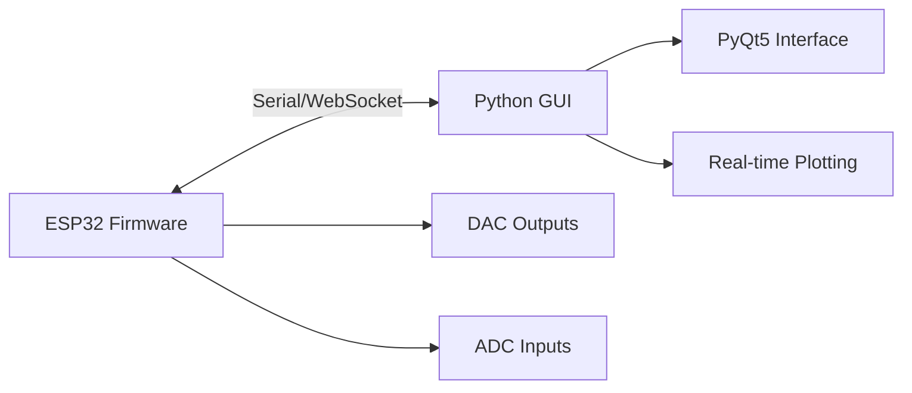

## Introduction

PhysisLab includes two powerful ESP32-based instruments designed for electronics education and experimentation:

- **Dual-Channel Oscilloscope**: Real-time signal visualization with 10 kHz sampling rate
- **Dual-Channel Signal Generator**: Arbitrary waveform generation using DAC outputs

Both instruments run on the ESP32 microcontroller and communicate with a Python-based GUI via Serial or WebSocket connections.

## Architecture

The instruments follow a distributed architecture:



### Hardware Components

<CardGroup cols={2}>
  <Card title="ESP32 DevKit" icon="microchip">
    - Dual-core 240 MHz processor
    - 12-bit ADC (GPIO 34, 35)
    - 8-bit DAC (GPIO 25, 26)
    - Serial/WiFi connectivity
  </Card>
  
  <Card title="Python GUI" icon="desktop">
    - PyQt5-based interface
    - Real-time plotting with pyqtgraph
    - Serial communication (115200 baud)
    - Live measurements and analysis
  </Card>
</CardGroup>

## Key Features

### Oscilloscope
- Dual-channel simultaneous sampling
- 10 kHz sampling rate per channel
- Configurable time base (50-2000 samples)
- Voltage and raw ADC display modes
- Automatic frequency estimation
- Zero-crossing detection

### Signal Generator
- Dual independent channels
- 40 kHz sample rate per channel
- Multiple waveforms: sine, square, triangle, sawtooth, DC
- Frequency range: 0.1 Hz - 10 kHz
- Configurable amplitude and offset
- Phase accumulator-based DDS

## Communication Protocol

Both instruments use simple text-based protocols over Serial:

<CodeGroup>
```bash Oscilloscope Commands
ADC START  # Begin streaming samples
ADC STOP   # Stop streaming
```

```bash Signal Generator Commands
CH1 SINE 1000 1 200 50     # Ch1: 1kHz sine, enabled, amp=200, offset=50
CH2 SQUARE 500 1 255 0     # Ch2: 500Hz square, enabled, full amplitude
```
</CodeGroup>

## Instrument Pages

<CardGroup cols={2}>
  <Card title="Oscilloscope" icon="wave-square" href="/instruments/oscilloscope">
    Learn about the dual-channel oscilloscope implementation, ADC configuration, and GUI features.
  </Card>
  
  <Card title="Signal Generator" icon="signal" href="/instruments/signal-generator">
    Explore the DAC-based waveform generator, DDS architecture, and control interface.
  </Card>
</CardGroup>

## Getting Started

<Steps>
  <Step title="Upload Firmware">
    Flash the Arduino firmware to your ESP32 using the Arduino IDE or PlatformIO.
  </Step>
  
  <Step title="Install Python Dependencies">
    ```bash
    pip install PyQt5 pyqtgraph numpy pyserial
    ```
  </Step>
  
  <Step title="Connect Hardware">
    Connect the ESP32 to your computer via USB. Note the serial port (e.g., `/dev/ttyUSB0` or `COM3`).
  </Step>
  
  <Step title="Launch GUI">
    ```bash
    python GUIOSCI.py
    ```
    Select the correct serial port and click Connect.
  </Step>
</Steps>

<Note>
The ESP32 will reset when the serial connection is established. Wait ~1.5 seconds after connecting before starting data acquisition.
</Note>

## Source Code Structure

```
osciloscopioygeneradordeSeñales/
├── Serial/                          # Serial communication versions
│   ├── GENERADOR_OSCILOSCOPIO/      # Combined oscilloscope + generator
│   ├── Generador_Senales_Serial/   # Standalone generator
│   └── interfaz/
│       ├── GUIOSCI.py              # Main GUI application
│       ├── GUIFFT.py               # FFT analysis version
│       └── GUIV3.py                # Alternative interface
└── websocket/                       # WebSocket-based versions
    ├── OSC_GEN/                     # Combined WebSocket implementation
    └── interfaz/
        └── GUIOSCI.py              # WebSocket GUI
```

## Next Steps

<CardGroup cols={2}>
  <Card title="Oscilloscope Details" icon="chart-line" href="/instruments/oscilloscope">
    Detailed documentation on oscilloscope features and implementation
  </Card>
  
  <Card title="Signal Generator Details" icon="waveform" href="/instruments/signal-generator">
    In-depth guide to waveform generation and DDS techniques
  </Card>
</CardGroup>